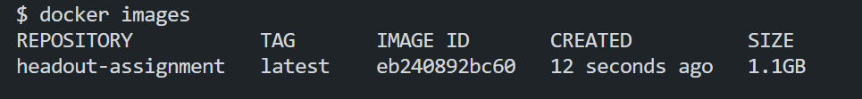
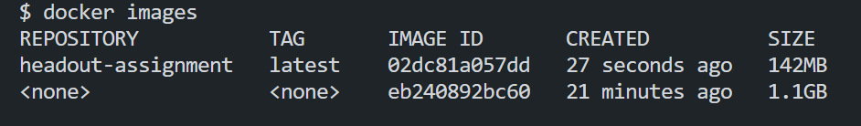
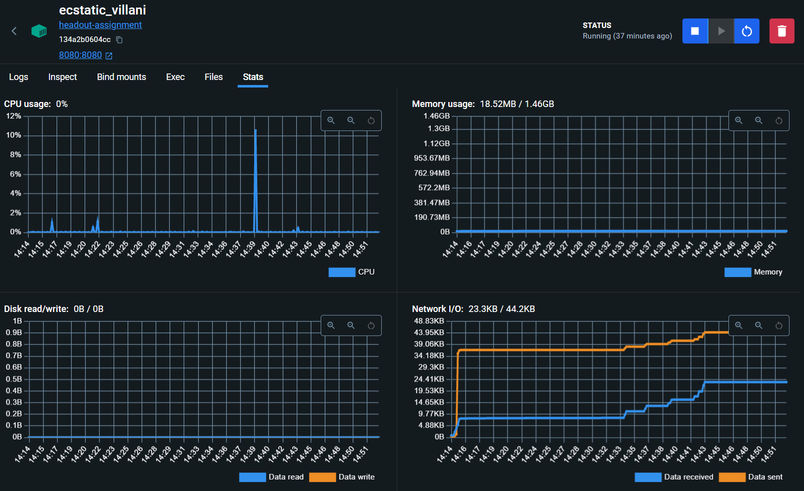

# Headout Assignment

## Optimizing HTTPS Server

### How to run the server in Docker

1. Clone the repository
2. Run the following command to build the docker image

```bash
docker build -t <image-name> .
```

3. Run the following command to run the docker image

```bash
docker run -d -p 8080:8080 --memory="1500m" --cpus="2.0" your-image-name
```

4. The server will be running on port 8080

### How to run the server locally

1. Clone the repository
2. Run the following command to install the dependencies

```bash
npm install
```

3. Run the following command to start the server

```bash
npm run dev
```

4. The server will be running on port 8080

### Some important points

- Sample text files contain some blank lines and some lines with only spaces thus it may seem that the server is not working but it is working fine.

- The server runs on the port 8080 and recieves the get request on the path `"/"`
  and return the initial welcome message
- Another request on the path `"/data?n={value}m={value}"` is recieved and the
  server returns mth line of the nth file in the `tmp/data` folder if it exits else it returns an error message
- The server is optimized to run on 2 cores and 1.5GB of memory

```
docker run -d -p 8080:8080 --memory="1500m" --cpus="2.0" your-image-name
# this command take care of memory and cpu allocation
```
- The server is optimized to run on 2 cores and 1.5GB of memory

## Optimzation
- For optimization I have used the minimal base image of node alpine
- without using the minimal base image the size of the image was 1.1GB
- with the minimal base image the size of the image was 142MB

### Old Size


### New Size


- I have also used the `--memory` and `--cpus` flag to limit the memory and cpu usage of the container

### Memory Usage



